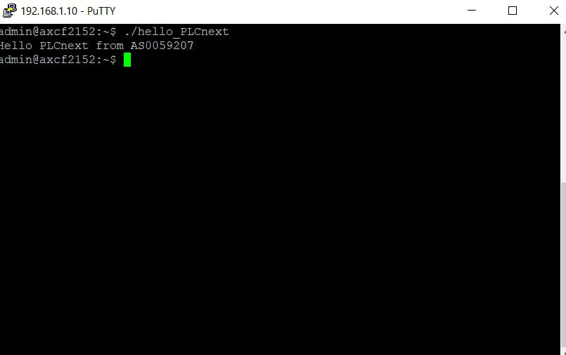

Министерство образования Республики Беларусь  
Учреждение образования   
Брестский Государственный Технический Университет  
Кафедра ИИТ
         
## Лабораторная работа №3
## "Работа с контроллером AXCF 2152"
         
Выполнил:  
Студент 3 курса  
Группы АС-59  
Горчинский Н.С.  

Проверил:
Иванюк Д.С.
         
Брест 2022

### Цель работы: запустить проект на контроллере AXCF 2152
## Ход работы 

В результате выполнения данной лабораторной работы ознакомился с контроллером AXC F2152.

В результате сборки и запуска через PuTTY имеем данный результат.
## Результат выполнения программы
