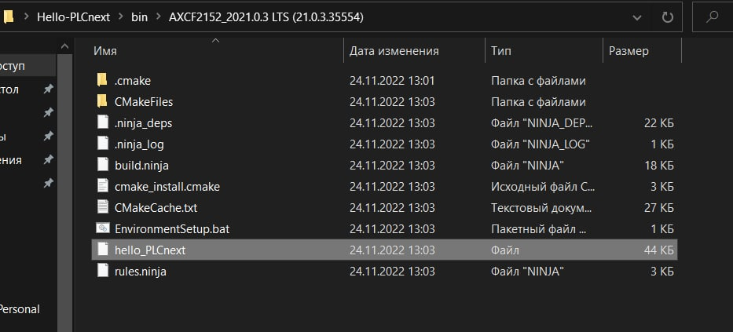
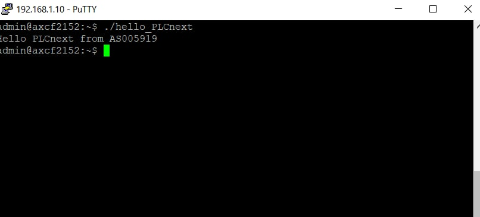

## 
Лабораторная работа №3 Работа с контроллером AXC F 2152

Выполнил: Левоцкий Н.Д. 
Проверил: Иванюк Д.С.

***
### Цель работы
Изучить руководство.

Используя MS Visual Studio создать тестовый проект "Hello PLCnext from AS05919!", собрать его и продемонстрировать работоспособность на тестовом контроллере. 

***
## Код программы:

Исходный код программы находящийся по пути trunk\as005917\task_03\src.

## Результат сборки программы 

Файл <i>hello_PLCnext</i> запускался на контроллере

## Результаты работы программы:

## Вывод
Изучил руководство к контроллеру AXCF2152, создал тестовый проект Hello-PLCNext и собрал его, запустил программу на тестовом контроллере.

