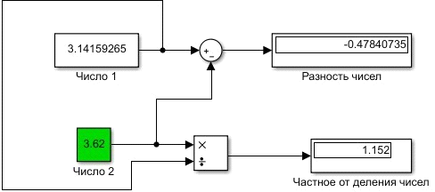
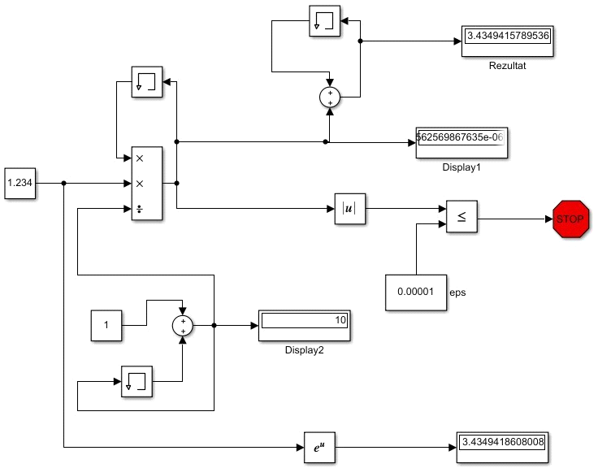
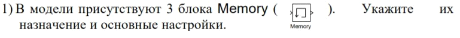
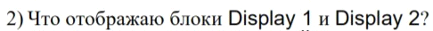
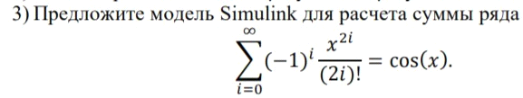
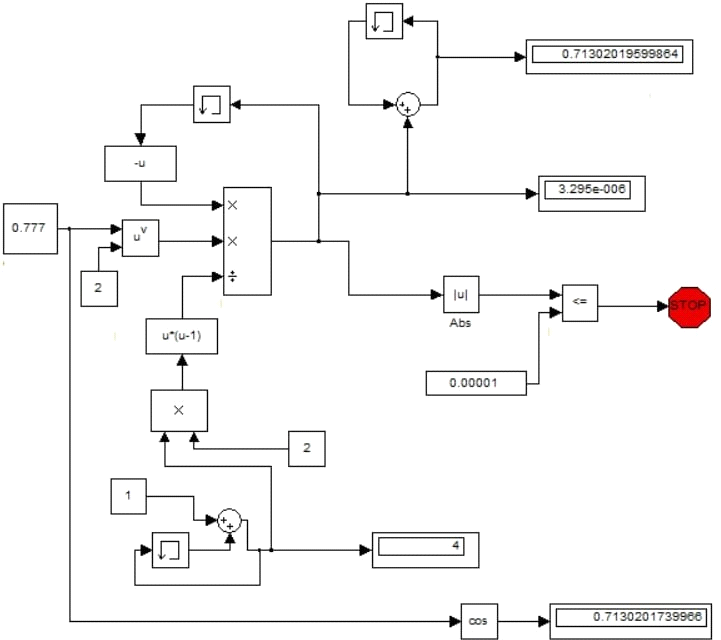

**<h1 align = "center">Знакомство с Simulink</a>**

Выполнил: Бойко Д.С.

Проверил: Пролиско Е.Е.

## **Цель работы:**

1) освоить основные операции используемые при построении модели Simulink (перенос блоков, соединение, настройка параметров, запуск); 2) построить модель вычислительного процесса на примере оценки суммы ряда.

## **Ход работы:**

Пример 1:  

Пример 2:  

  

  

Блок memory используется для задержки на один шаг интеграции. Выходным значением является предыдущее входное значение.

Display1 отображает последнюю переменную a(i). Display2 отображает количество итераций – i

  

## **Вывод:**

Освоил основные операции используемые при построении модели Simulink, построил модель для определённого случая.

