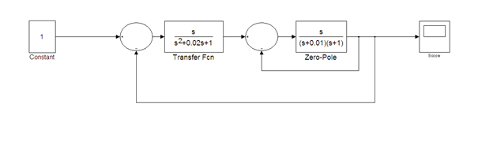
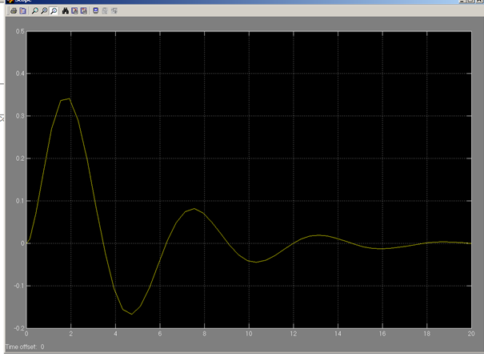
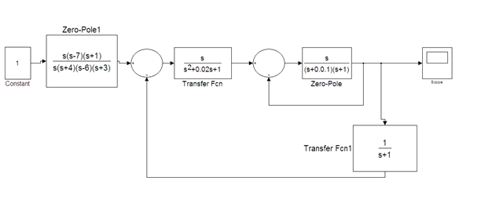
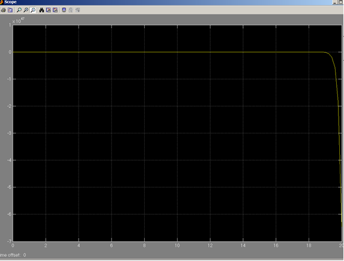
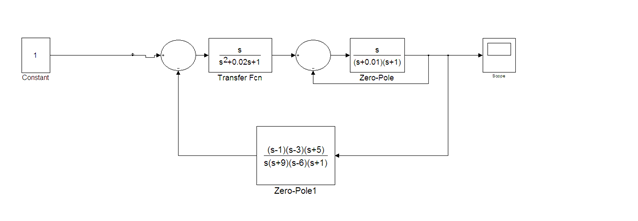
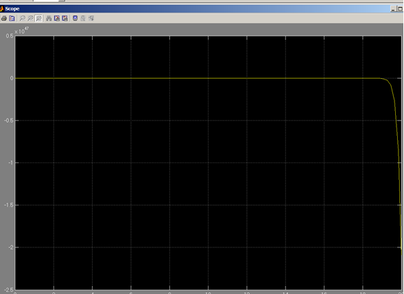

**<h1 align = "center">Модель системы с сложной передаточной функцией</a>**

Выполнил: Бобко Д.С.

Проверил: Пролиско Е.Е.

## **Цель работы:**

1) научиться строить в Simulink модель системы с сложной структурой с
обратными связями.

## **Ход работы:**

Дата рождения 02.01.2003

Основное задание:

  

  

Дополнительные задания:

Задание дополнительное 1

Задание дополнительное 2  

## **Вывод:**

Получены навыки строительства моделей систем со сложной структурой с обратными связями в Simulink.

