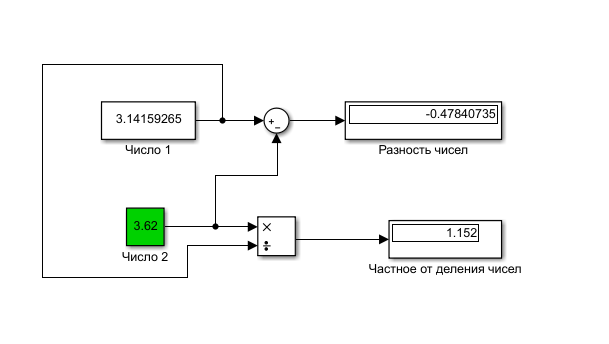
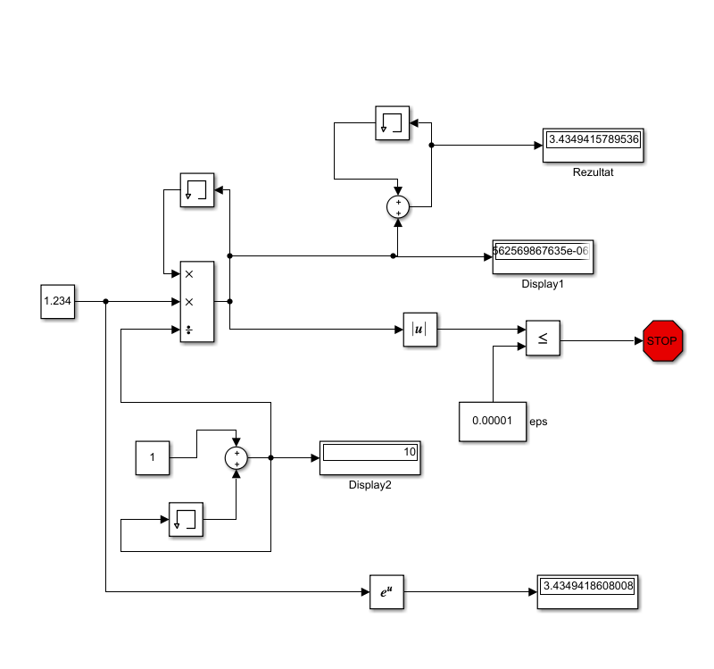
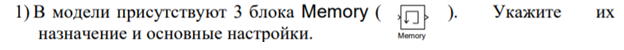
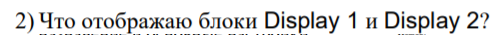
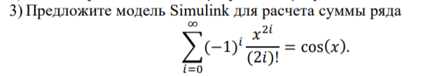
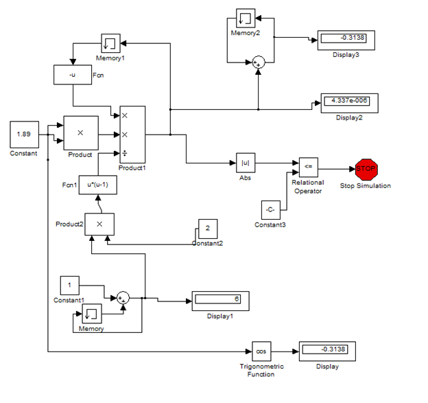

<h1 align = "center">Знакомство с Simulink</a>

Выполнила: Букатюк Е.В. 

## **Цель работы:**

освоить основные операции используемые при построении модели Simulink (перенос блоков, соединение, настройка параметров, запуск); 2) построить модель вычислительного процесса на примере оценки суммы ряда.

## **Ход работы:**

Пример 1  

  

Пример 2  

  

  

Блок memory используется для хранения предыдущей переменной для расчета по формуле

  

Display1 отображает последнюю переменную a(i)  
Display2 отображает наше количество итераций – i  

  

## **Вывод:**

освоил основные операции используемые при построении модели Simulink, а также построил модель для определённого случая.

