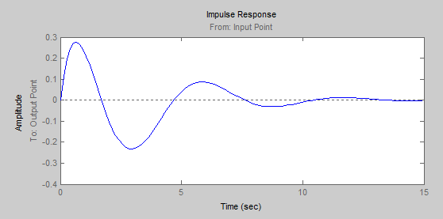

<h1 align = "center">«LTI-Viewer»</a>

Выполнил: Букатюк Е.В. 

Выполнил: Пролиско Е.Е.  

## **Цель работы**

Пoстроить в Simulink модель системы со сложной структурой и обратными связями. Освоить использование LTI-viewer

## **Ход работы**

Дата рождения: 20.03.2003

  

После подключение LTI-viewer получили следующие характеристики:

  

Реакция на единичное ступенчатое воздействие:

  

  

Диаграмма Найквиста:  

  

Реакция на единичное импульсное воздействие:

Логарифмические амплитудная и фазовая частотные характеристики:

Нули и полюса системы:

## **Вывод**

Получил навыки построения моделей систем со сложной структурой с обратными связями в Simulink и использования LTI-viewer.

