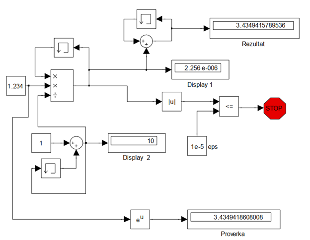
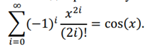
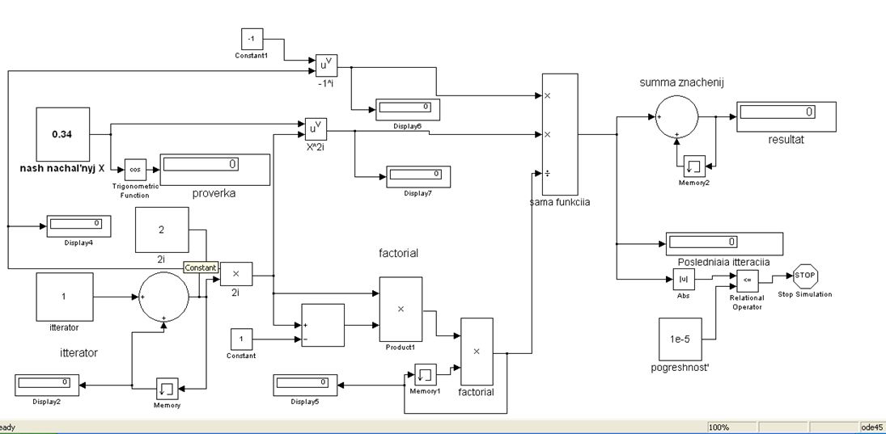

***<h1 align = "center">Знакомство с Simulink</a>***

выполнил: Дворанинович Д.А.

  

проверил: Пролиско Е.Е.

## **Цель работы**

1) освоить основные операции используемые при построении модели Simulink (перенос блоков, соединение, настройка параметров, запуск);

  

2) построить модель вычислительного процесса на примере оценки суммы ряда.

  

  
  
  
  
  
  