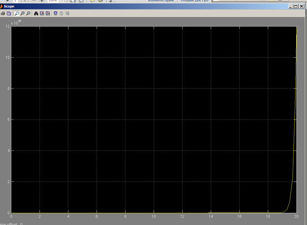

***<h1 align = "center">Модель системы с сложной передаточной функцией</a>***

выполнил: Дворанинович Д.А.

  

проверил: Пролиско Е.Е.

## **Цель работы**

1) научиться строить в Simulink модель системы с сложной структурой с
обратными связями; 

  

Дата рождения 29.05.2003  
Основное задание  

  
  
  
  
Дополнительные задания  
Задание дополнительное 1  

  
  
  
  
Задание дополнительное 2  
  
  
  
  
  
## **Вывод**  

получены навыки строительства моделей систем со сложной структурой с обратными связями в Simulink.

  