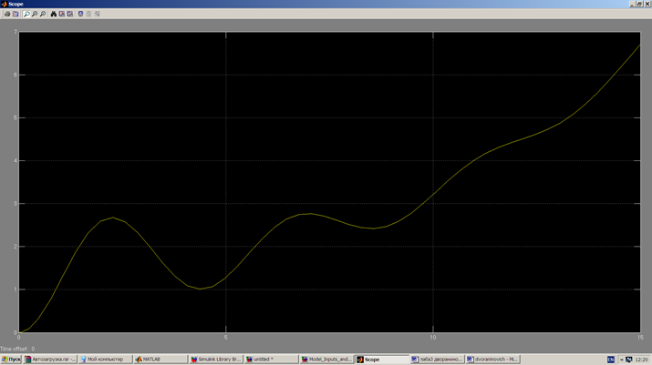

***<h1 align = "center">LTI viever</a>***

выполнил: Дворанинович Д.А.

  

проверил: Пролиско Е.Е.

## **Цель работы**

освоить использование LTI viever

  
  
  
  
  
  
  
  
  
  
  
  
  
  
  
  
  
  
  
  
  
  
  
  
## **Вывод:**  

были получены основные графики поведения через LTI viever

  