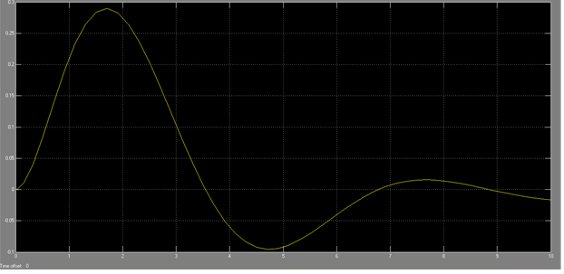

***<h1 align = "center">Модель системы с сложной передаточной функцией созданной и просчитанной вручную</a>***

выполнил Дворанинович Д.А.

  

проверил Пролиско Е.Е.

## **Цель работы**

1) создать из готовой модели, модель состоящую из одного блока

  
Дата рождения 29.05.2003  
Основное задание  
 

 
 

Ручной расчет 
  
 

Графики новой функции: 
  
  
  
  
  
  
  
  
  
  
  
  
  
  
  
  
  
  

  
## **Вывод**  

по данным графикам LTI viewer можно оценить функцию и увидеть, что данная вункция устойчива

  