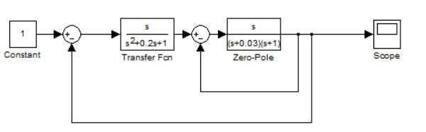
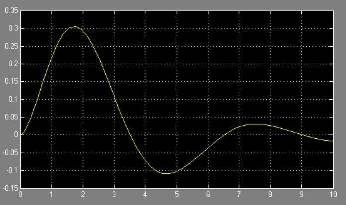
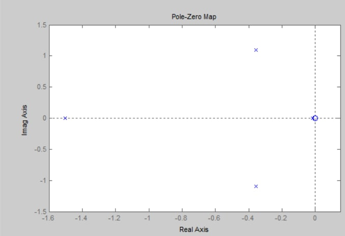

**<h1 align = "center">Модель системы со сложной передаточной функцией созданной и просчитанной вручную</a>**

Выполнил: Евчук Я.Р.

## **Цель работы:**

Пoстроить в Simulink модель системы со сложной структурой и обратными связями. Просчитать передаточную функуцию вручную и определить ее характеристики.

## **Ход работы:**

Дата рождения: 20.03.2003

Исходная модель:

Scope:

Ручной расчет сложной передаточной функции:
W1 = s/(s^2+0.2s+1)

W2 = s/((s+0.03)(s+1))

1 действие : W11 = W1/(1+W1)

2 действие : W12 = W11 * W2

3 действие : W22 = W12/(1+W12)

тогда наша передаточная функция:

W= W22

подставив изначальные значения получим ПФ:

W = 500s^2/(500s^4+1115s^3+1218s^2+1018s+15)

Графики для полученной системы с передаточной функцией:

Графики, полученные с LTI-viewer:

## **Вывод:**

Получили навыки построения моделей систем со сложной структурой с обратными связями в Simulink, просчитали сложную передаточную функцию.

