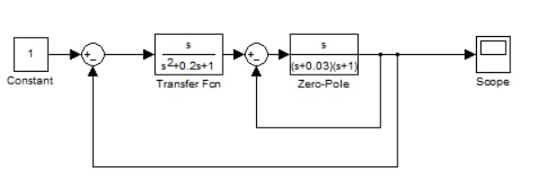
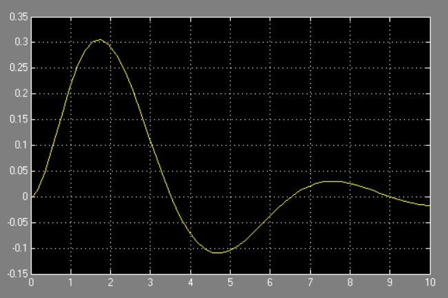
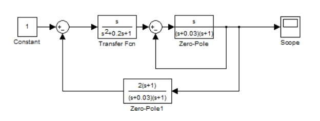
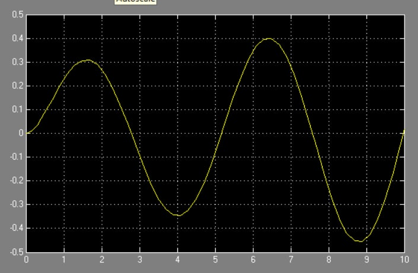
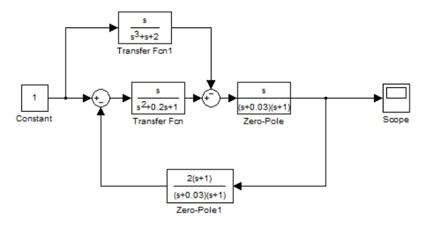
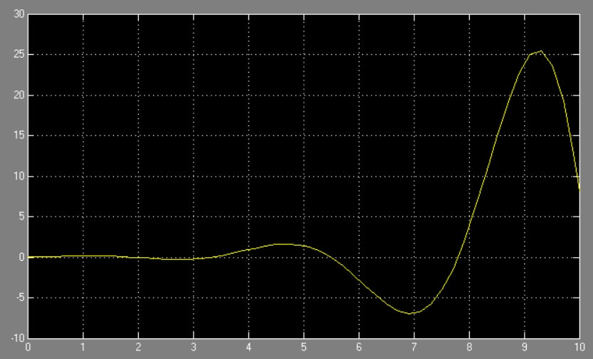

**<h1 align = "center">Модель системы со сложной передаточной функцией</a>**

Выполнил: Евчук Я.Р.

## **Цель работы:**

Пoстроить в Simulink модель системы со сложной структурой и обратными связями.

## **Ход работы:**

Дата рождения: 20.03.2003

Основная модель:

Scope:

Дополнительное задание 1:

Добавили Zero-Pole:

Scope:

Дополнительное задание 2:

Добавили Transfer Function:

Scope:

## **Вывод:**

получили навыки построения моделей систем со сложной структурой с обратными связями в Simulink.

