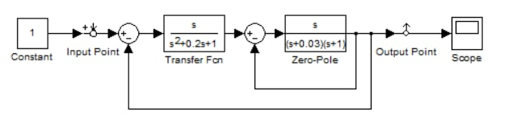
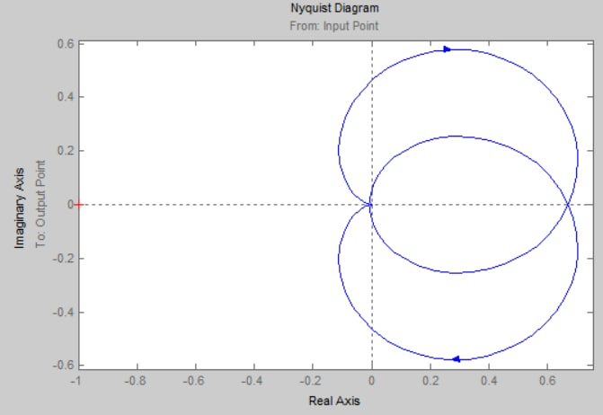
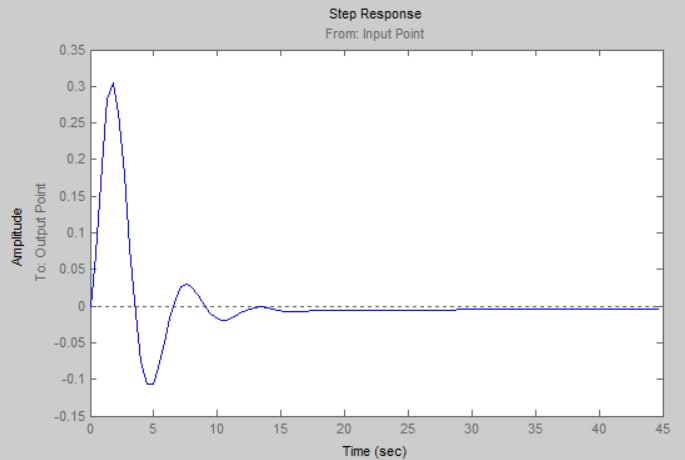
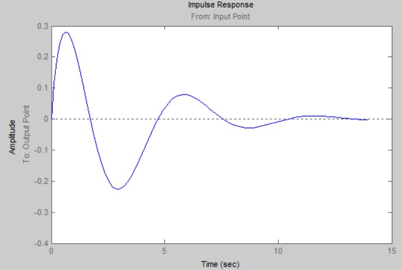
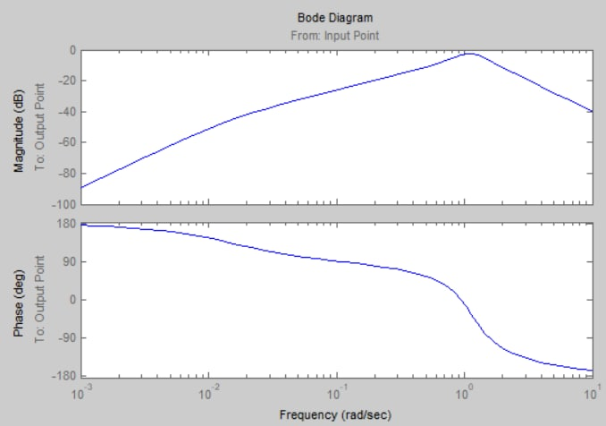
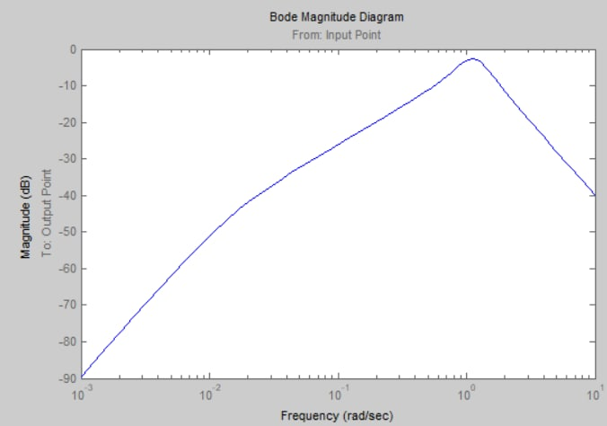
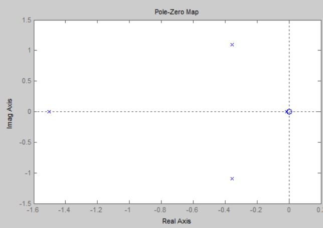

**<h1 align = "center">«Знакомство с LTI-Viewer»</a>**

Выполнил: Евчук Я.Р. 

## **Цель работы:**

Пoстроить в Simulink модель системы со сложной структурой и обратными связями. Освоить использование LTI-viewer

## **Ход работы:**

Дата рождения: 20.03.2003

Основная модель:

Подключили LTI-viewer.
Диаграмма Найквиста:

Реакция на единичное ступенчатое воздействие::

Реакция на единичное импульсное воздействие:

Логарифмические амплитудная и фазовая частотные характеристики:

 Логарифмическая амплитудная частотная характеристика:

Нули и полюса системы:

Получив данные характеристики, можем сделать вывод , что система устойчива.

## **Вывод:**

Получили навыки построения моделей систем со сложной структурой с обратными связями в Simulink и использования LTI-viewer.

