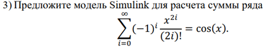

**<h1 align = "center">Знакомство с Simulink</a>**

Выполнил: Капитанов Д.А.

Проверил: Пролиско Е.Е.

## **Цель работы:**

освоить основные операции используемые при построении модели Simulink; построить модель вычислительного процесса на примере оценки суммы ряда.

## **Ход работы:**  

  

1)	В модели присутствуют 3 блока Memory. Укажите их назначение и основные настройки.

  

Блок memory используется для хранения предыдущей переменной для расчета по формуле.

  

2)	Что отображают блоки Display1 и Display2.

  

Display1 отображает последнюю переменную a(i)

  

Display2 отображает наше количество итераций – i

  

  

  

## **Вывод:**

освоил основные операции используемые при построении модели Simulink, а также построил модель для определённого случая.

