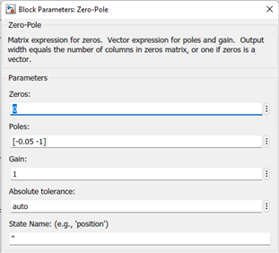

**<h1 align = "center">Модель системы со сложной передаточной функцией</a>**

Выполнил: Капитанов Д.А.

Проверил: Пролиско Е.Е.

## **Цель работы:**

научиться строить в Simulink модель системы с сложной структурой с 
обратными связями.

## **Ход работы:**

Задание:  
– запустите Matlab и в нем Simulink;  

– откройте новое окно модели и постройте модель системы, например,
следующего вида;

В используемых передаточной функции (Transfer Fcn) и функции нулиполюса (Zero-Pole) «конструируете» передаточные функции блоков

  

где А = номер дня рождения / 100; В = номер месяца рождения / 100 .

Замечание. Можно использовать любую другую структуру.

– на осциллографе (Scope) получите переходную функцию системы. 

Сделайте выводы;  

  

  

  

  

Пример 1:  

  

  

  

Пример 2:  

  

  

  

## **Вывод:**  

 были построены в Simulink модель системы с сложной структурой с 
обратными связями.

