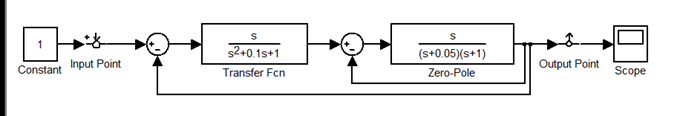
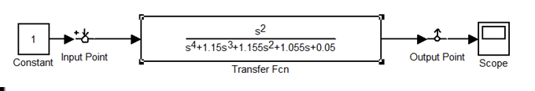
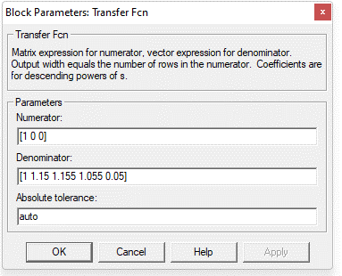
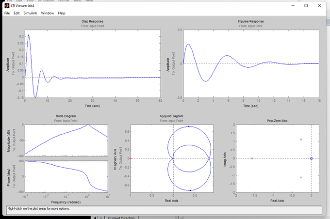
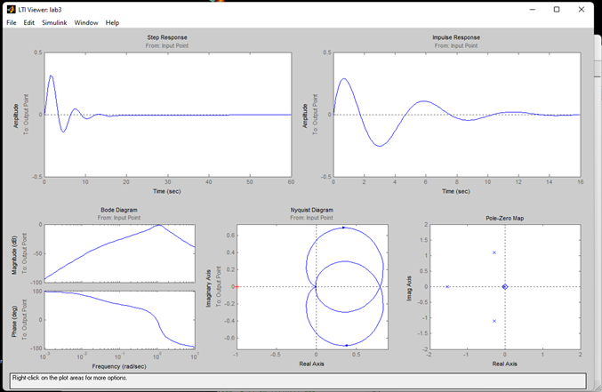

**<h1 align = "center">Преобразование цепей</a>**

Выполнил: Капитанов Д.А.

Проверил: Пролиско Е.Е.

## **Цель работы:**

изучение и использование LTI-viewer.

## **Ход работы:**

Задание:  

Цель: взять схему из предыдущей работы и, при помощи преобразований, упростить схему до одного блока. Сравнить параметры исходной и полученной схемы в LTI-viewer.

Изначальная схема:  

  

Преобразованная схема:  

  

  

Параметры:  
Преобразованной схемы  

  

Изначальной схемы созданной в предыдущей работе.  

  

## **Вывод:**

изначальная схема и преобразованная схема эквивалентны, т.к. параметры идентичны.

