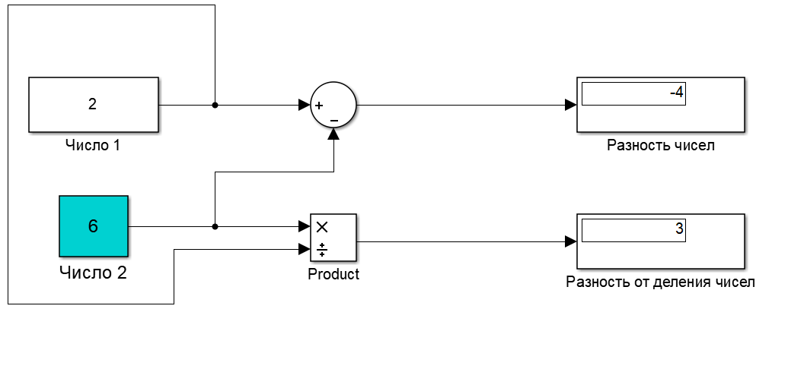
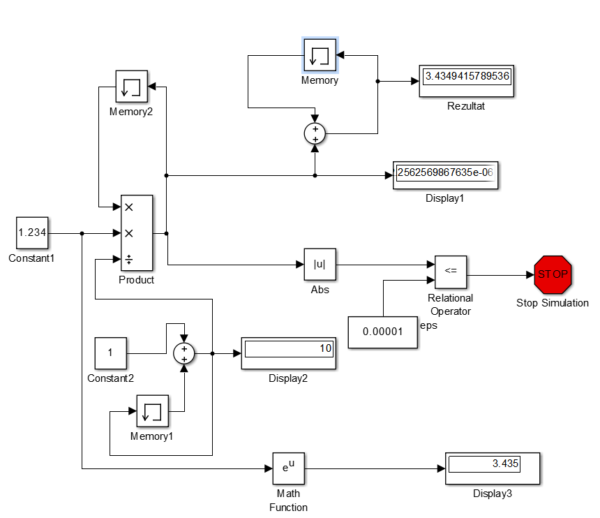

***<h1 align = "center">Знакомство с Simulink</a>***

Выполнил: Кицило Р.Д.

## **Цель работы:**

освоить основные операции используемые при построении модели Simulink (перенос блоков, соединение, настройка параметров, запуск);
построить модель вычислительного процесса на примере оценки суммы ряда.

## **Ход работы:**

Пример №1:

Пример №2:

## **Задание:**

Ответ:
Блок memory используется для хранения предыдущей переменной для расчета по формуле.

Ответ:
Display1 отображает последнюю переменную a(i);
Display2 отображает наше количество итераций – i

3) Предложить модель Simulink для расчёта суммы ряда:

## **Вывод:**

освоил основные операции используемые при построении модели Simulink, а также построил модель для определённого случая.

Работа проделана в 
Mathworks Matlab R2014a (8.03)

