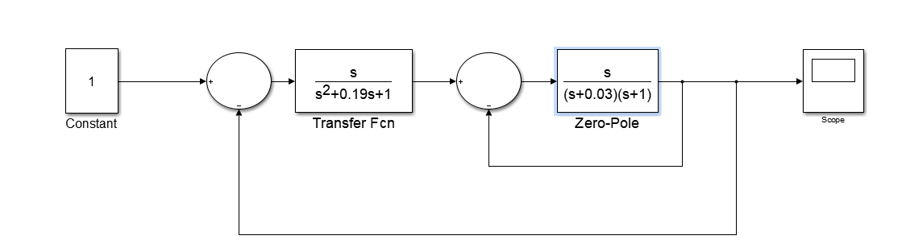
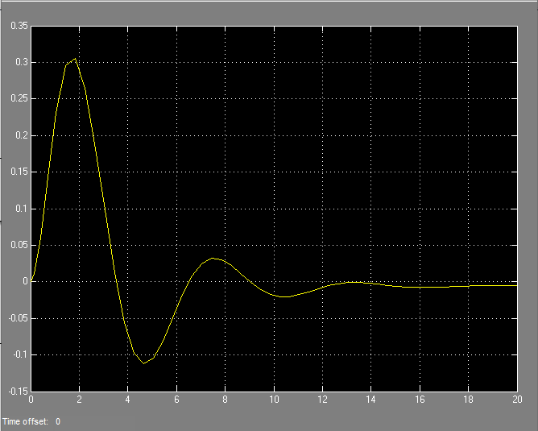
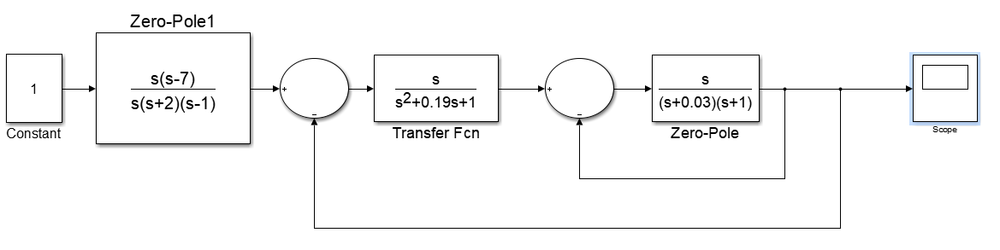
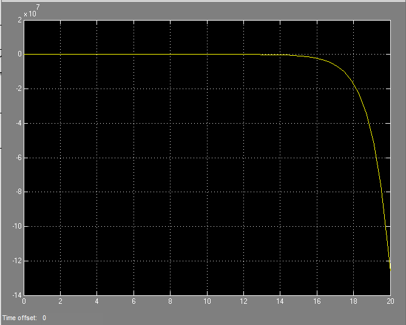
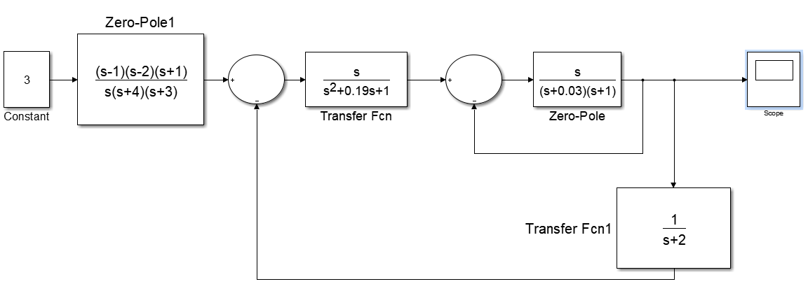
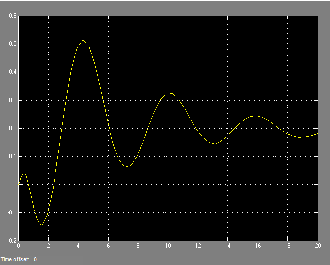

***<h1 align = "center">Модель системы со сложной передаточной функцией</a>***

Выполнил: Кицило Р.Д.

## **Цель работы:**

научиться строить в Simulink модель системы с сложной структурой с 
обратными связями.

## **Задание:**

– запустите Matlab и в нем Simulink;

– откройте новое окно модели и постройте модель системы.

В используемых передаточной функции (Transfer Fcn) и функции нулиполюса (Zero-Pole) «конструируете» передаточные функции блоков, где А = номер дня рождения / 100; В = номер месяца рождения / 100 .
Замечание. Можно использовать любую другую структуру.
– на осциллографе (Scope) получите переходную функцию системы. 

## **Ход работы:**

дата рождения: 19.03.2003

Основное задание:

Scope 1:

Дополнительное задание 1:

Scope 2:

Дополнительное задание 2:

Scope 3:

## **Вывод:**

были построены в Simulink модель системы с сложной структурой с обратными связями.

Работа проделана в 
Mathworks Matlab R2014a (8.03)

