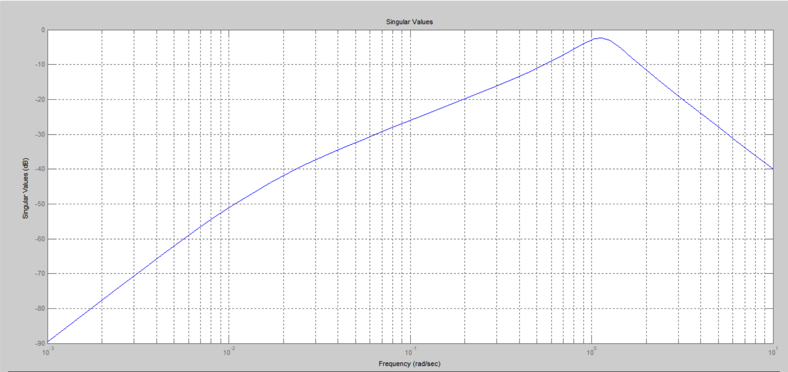

***<h1 align = "center">LTI viewer </a>***

Выполнил: Кицило Р.Д.

## **Цель работы:**

освоить использование LTI viever.

## **Ход работы:**

## **Задание:**

– подключите LTI-viewer к вашей системе;

– получите основные характеристики системы (передаточную функцию, 
импульсную характеристику, амплитудно-частотную и фазо-частотные 
характеристики, диаграмму Найквиста, значение нулей и полюсов);

– получите блок с передаточной функцией эквивалентной передаточной 
функции исходной системы;

– покажите, что все характеристики и показатели сохраняются.

система с подключенной LTI-viewer:

scope:

LTI(step):

LTI(bode):

LTI(bode-grid):

LTI(impulse):

LTI(nichols):

LTI(nuqest):

LTI(pole-zero):

LTI(signal):

## **Вывод:**

были получены основные графики поведения через LTI viewer,
система устойчива. 

Работа проделана в 
Matlab 6.1.0.450 Release 12.1

