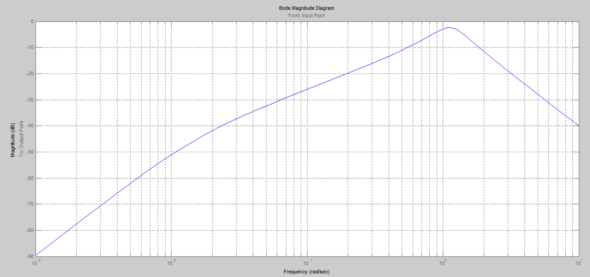

***<h1 align = "center">ВИДЫ ПЕРЕХОДНЫХ ПРОЦЕССОВ И ЧАСТОТНЫХ ХАРАКТЕРИСТИК ТИПОВЫХ ДИНАМИЧЕСКИХ ЗВЕНЬЕВ</a>***

Выполнил: Кицило Р.Д.

## **Цель работы:**

сформировать из собранной модели из Лаб№2, форму состоящую из 1-го блока.

## **Ход работы:**

## **Задание:**

Сконструировать в simulink модель со структурой а также обратной связью. В применяемых придаточной функции и функции полюсов-нулей (Zero-Pole, Transfer Fcn) построить предаточные функции блокоов. Вычислить предаточную функцию и установить её характеристики.

система с подключенной LTI-viewer:

Расчет сложной передаточной функции по формуле Мейсона:

P=-L1

Δ1=1 

W1= 10000*S^2/10000*S^4+12200*S^3+12257*S^2+10357*S+300

L2= -s/((s+0.03)(s+1))

Δ=1-L1-L2= (24157*S^2+10000*S^4+22200*S^3+20357*S+300)/(10000*S^4+12200*S^3+12257*S^2+10357*S+300)

получили функцию:

W= (P*Δ1)/Δ=10000s^2/10000s^4+22200s^3+24157s^2+20357s+300

система полученная после вычислений:

scope:

LTI(step):

LTI(bode):

LTI(bode-grid):

LTI(impulse):

LTI(nichols):

LTI(nuqest):

LTI(pole-zero):

LTI(signal):

## **Вывод:**

Получены навыки построения моделей систем со сложной структурой с обратной связью, расчитанна сложная передаточная функция.

Работа проделана в 
Matlab 6.1.0.450 Release 12.1

