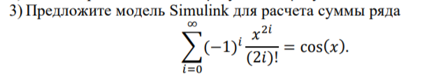

***<h1 align = "center">Знакомство с Simulink</a>***

Выполнила: Титова К.А.

## **Цель работы:**

1) освоить основные операции используемые при построении модели Simulink (перенос блоков, соединение, настройка параметров, запуск); 2) построить модель вычислительного процесса на примере оценки суммы ряда.

## **Ход работы:**

Пример 1.

Пример 2.

## **Задание:**

1) В модели присутствуют три блока Memory. Укажите его назначение и основные настройки.
   
Блок memory используется для задержки на один шаг интеграции. Выходным значением является предыдущее входное значение.

1) Что изображают блоки Display1 и Display2?

Display1 отображает последнюю переменную a(i). Display2 отображает количество итераций – i

## **Вывод:**

освоила основные операции используемые при построении модели Simulink, а также построила модель для определённого случая.

