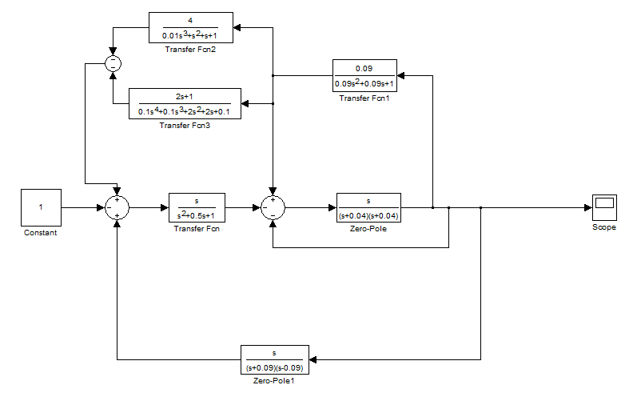
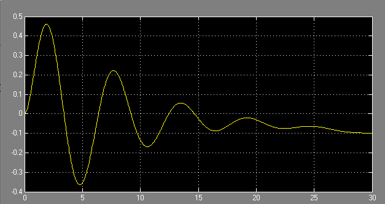

***<h1 align = "center">Модель системы с сложной передаточной функцией</a>***

Выполнил: Левчук Н.Д

## **Цель работы:**

Yаучиться строить  в Simulink  модель системы со сложной структурой с обратными связями.

## **Ход работы:**

Составная модель

Полученная переходная функция системы:

## **Вывод:**

Исходя из переходной функции, можно сделать вывод, что данная система находится, т.к  амплитуда сигнала со временем стремится к постоянному значению.

