***<h1 align = "center">LTI-Viewer</a>***

Выполнил: Левчук Н.Д

## **Цель работы:**

Получить различные характеристики системы с помощью прибора "LTI-Viewer" и сделать соответствующие выводы по устойчивости системы"

Исходные схемы:

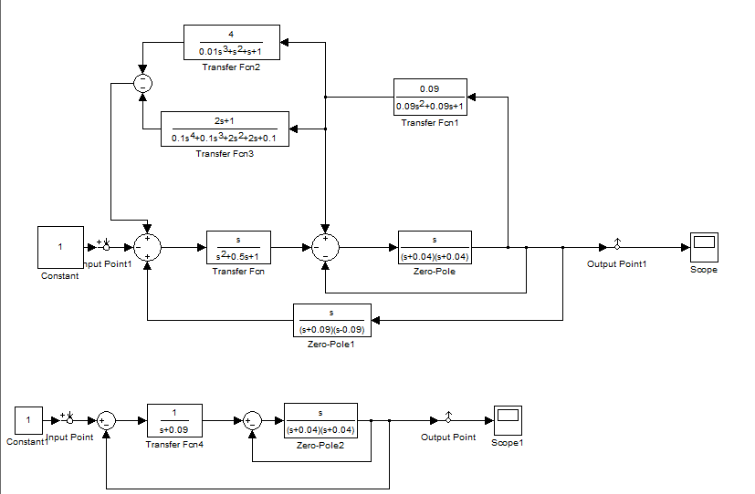

Схема 1:
Step responce:

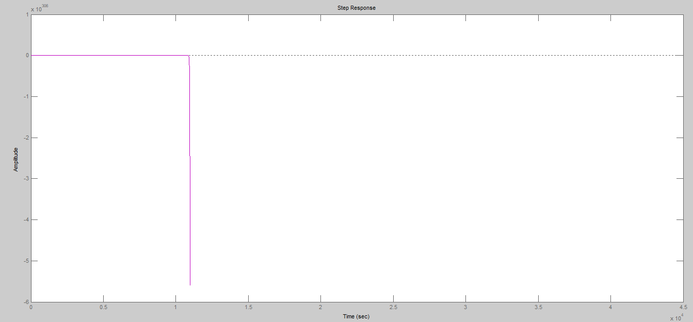

Impulse response:

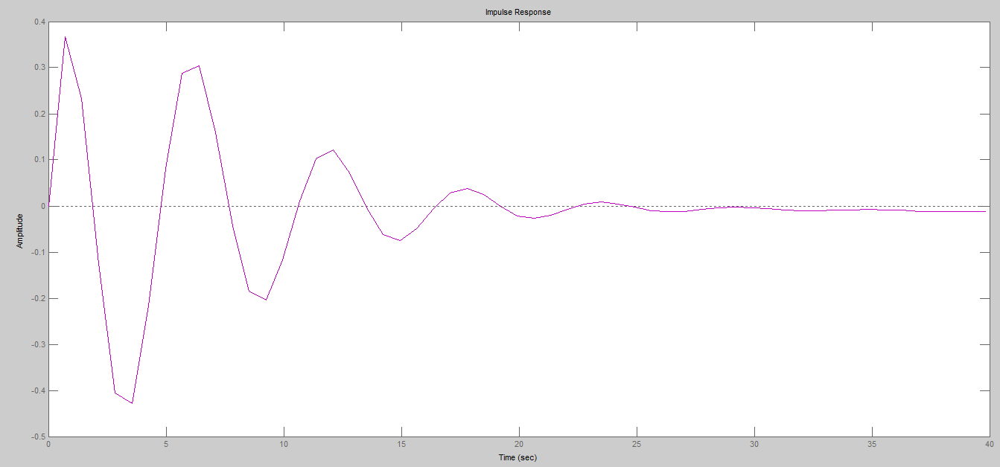

Bode:

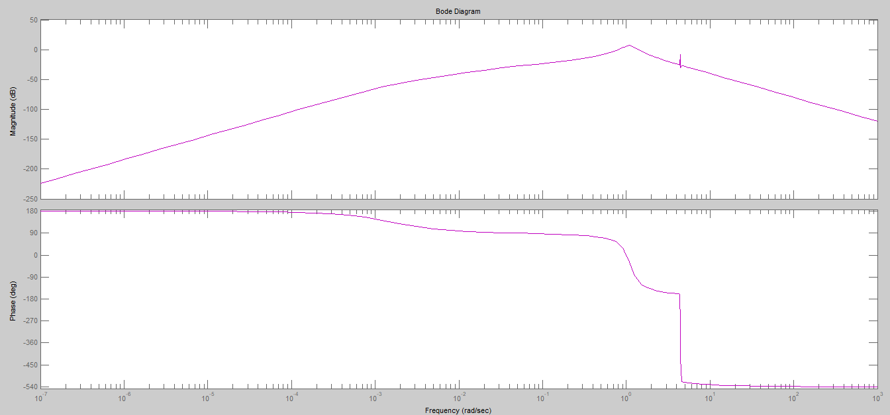

Bode magnitude:

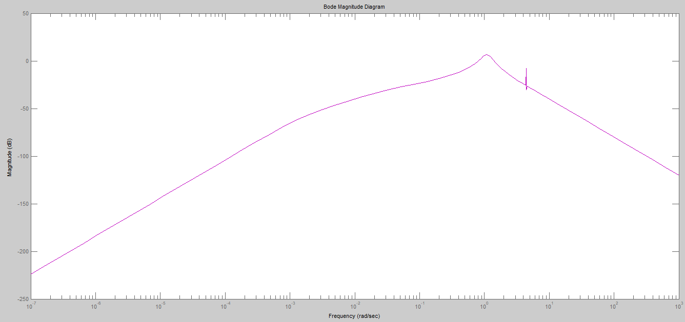

Nyquist:

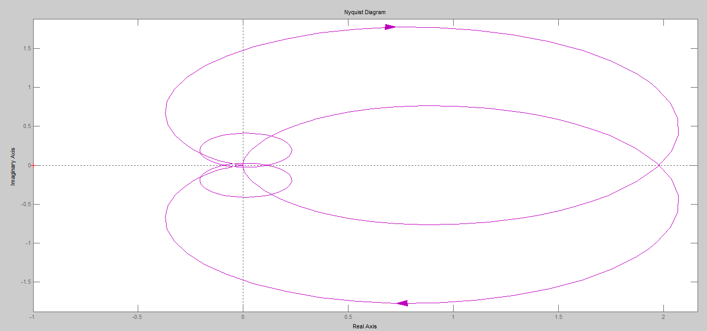

Nichols:

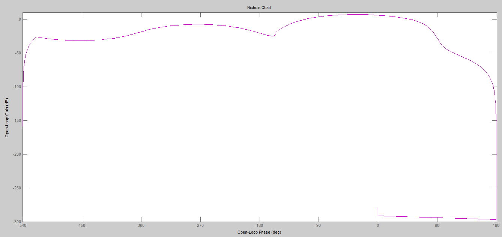

Sigma:

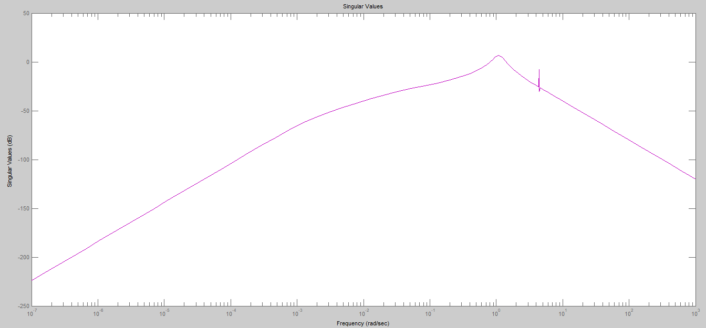

Pole-Zero:

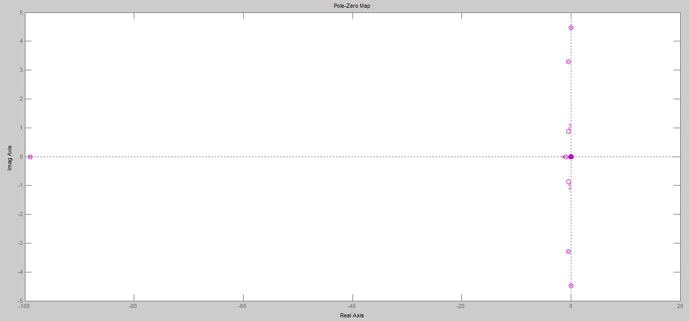

Схема 2:
Step responce:

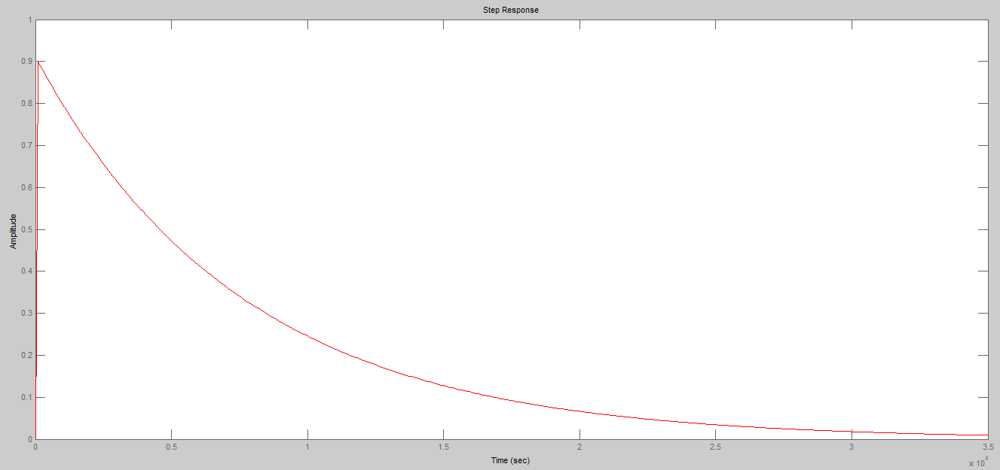

Impulse response:

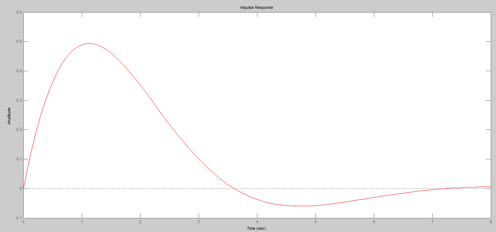

Bode:

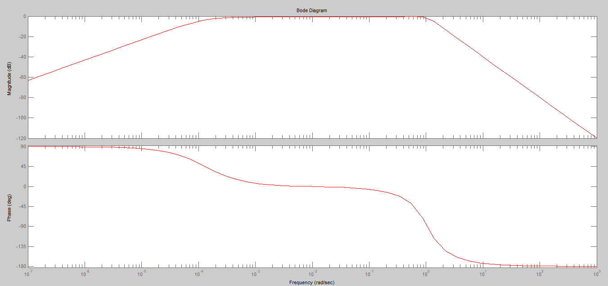

Bode magnitude:

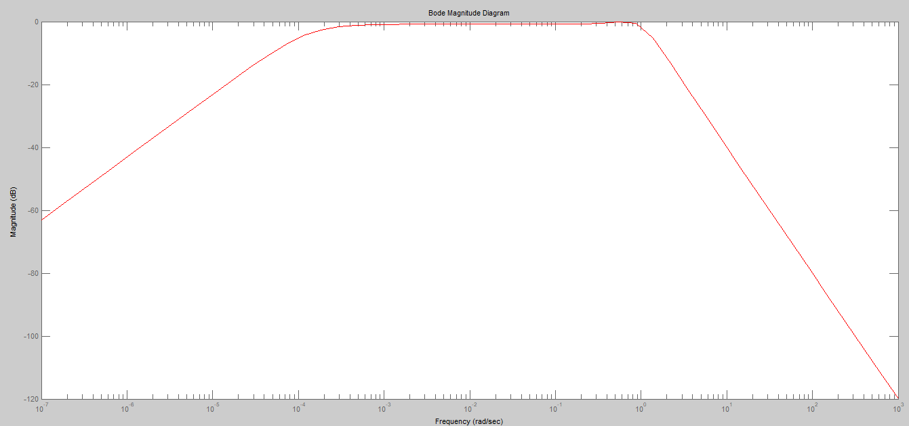

Nyquist:

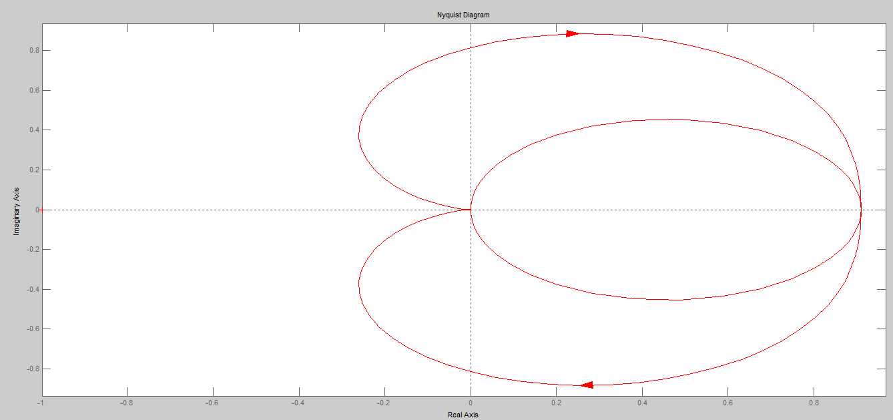

Nichols:

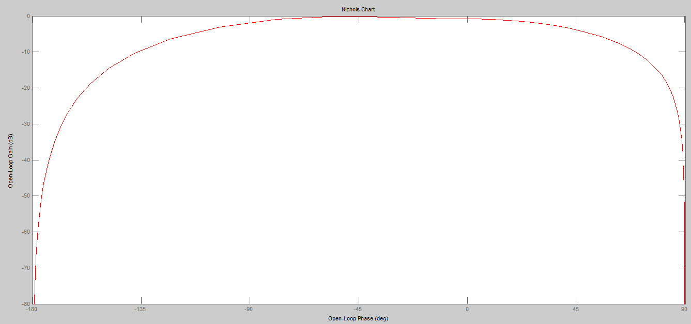

Sigma:

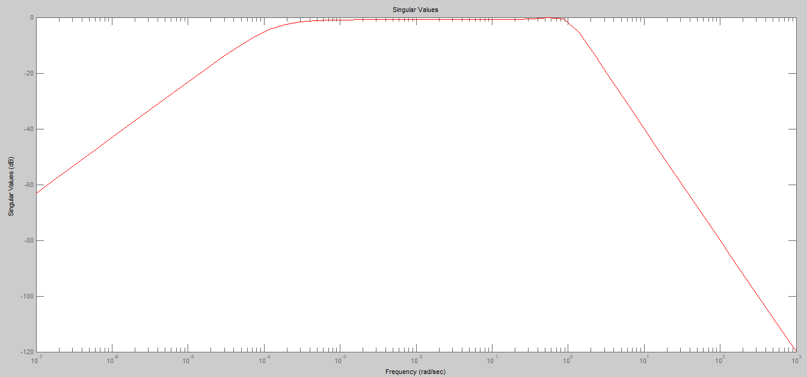

Pole-Zero:

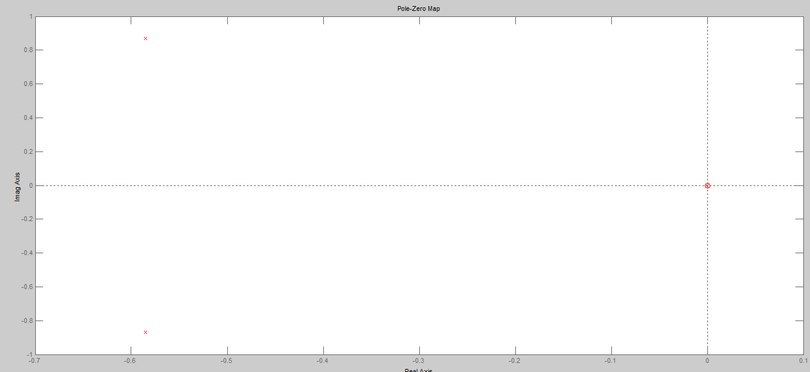

## **Вывод:**

Исходя из полученных данных, можно сделать вывод, что первая схема неустойчива, т.к имеются полюса с положительной действительной частью в графике Pole/Zero, а вторая устойчива, т.к у нее нет полюсов с положительной действительной частью в графике Pole/Zero.

