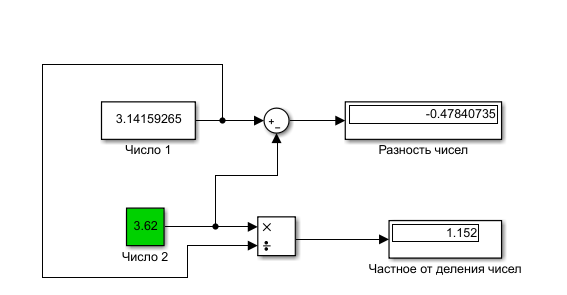
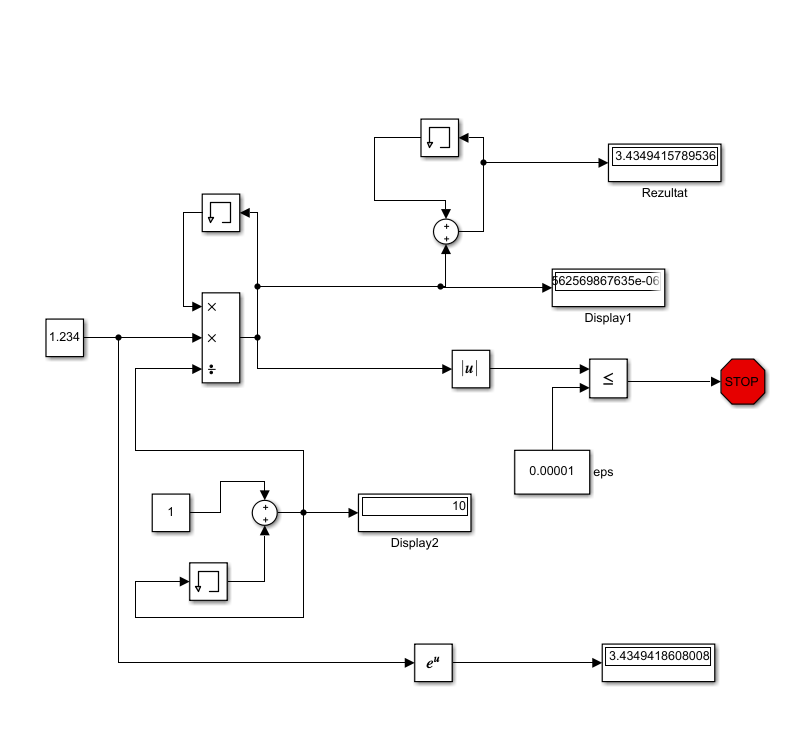
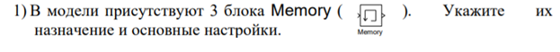
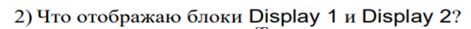
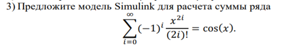
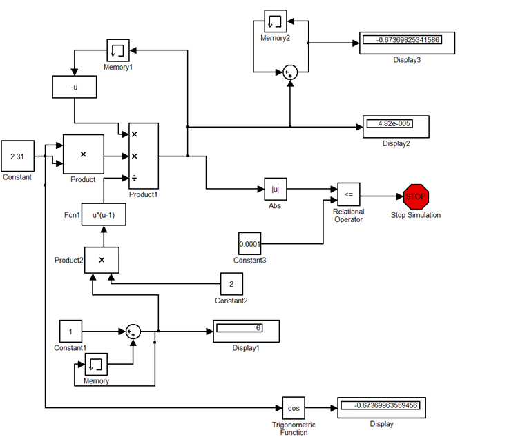

***<h1 align = "center">Знакомство с Simulink</a>***

Выполнил: Марцинкевич И.Г.

Проверил: Пролиско Е.Е.

## **Цель работы:**

1) освоить основные операции используемые при построении модели Simulink (перенос блоков, соединение, настройка параметров, запуск); 2) построить модель вычислительного процесса на примере оценки суммы ряда.

пример 1:  

пример 2:  

  

Блок Memory используется для хранения значения переменной с предыдущей итерации системы.

Display1 отображает последнюю переменную a(i)  
Display2 отображает наше количество итераций – i

