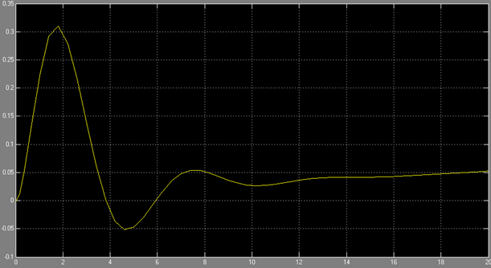

***<h1 align = "center">Модель системы с сложной передаточной функцией</a>***

Выполнил: Марцинкевич И.Г.

Проверил: Пролиско Е.Е.

## **Цель работы:**

1) научиться строить в Simulink модель системы с сложной структурой с обратными связями.

## **Задания:**

 – запустите Matlab и в нем Simulink;  
 

 – откройте новое окно модели и постройте модель системы, например, следующего вида;

 

В используемых передаточной функции (Transfer Fcn) и функции нули-полюса (Zero-Pole) «конструируете» передаточные функции блоков.  

  

 

где А = номер дня рождения / 100; В = номер месяца рождения / 100 . Замечание. Можно использовать любую другую структуру. 

– на осциллографе (Scope) получите переходную функцию системы. Сделайте выводы;

  
  