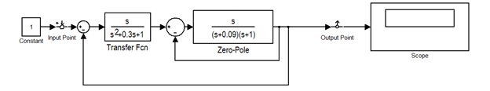
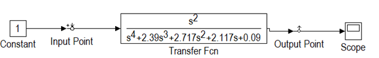
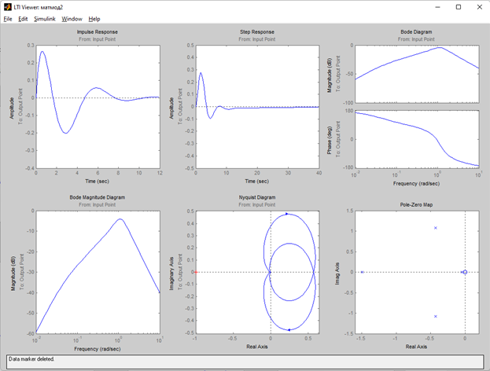
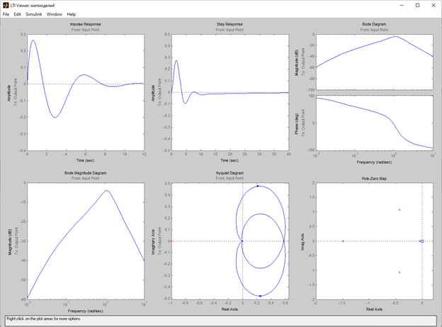

***<h1 align = "center">LTE-viewer</a>***

Выполнил: Марцинкевич И.Г.

 

Проверил: Пролиско Е.Е.

 

## **Цель работы:**

Взять схему из предыдущих работ и, при помощи преобразований, упростить схему до одного блока. Сравнить параметры исходной и полученной схемы в LTI-viewer.

Изначальная схема:  

  

Преобразованная схема:  

  

Параметры систем:  

## **Вывод:**

Исходя из того, что параметры систем идентичны, можно сделать вывод, что данные схемы эквивалентны.

  
