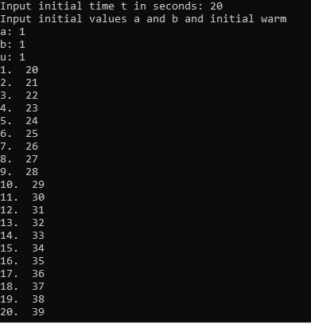
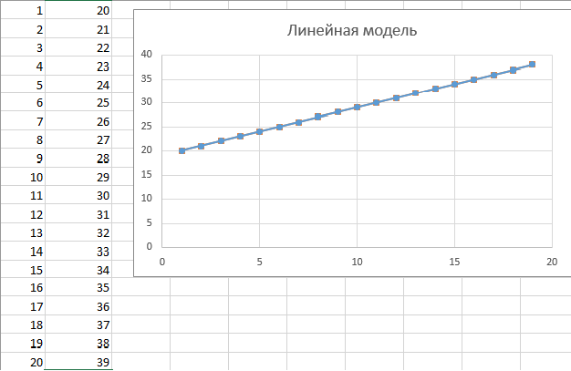

# Лабораторная работа №1    
Министерство образования Республики Беларусь    
Учреждение образования Брестский Государственный Технический Университет    
Кафедра ИИТ    
         
## Лабораторная работа №1
### по дисциплине "Математические модели информационных процессов и управления"
### "Моделирование контролируемого объекта"
       
Выполнила: 

Студентка 3 курса  
Группы АС-59  
Пархоць А. !В.  

Проверил:  

Иванюк Д. С.
       
Брест 2022
    

### Цель работы: контроль температуры объекта.
## Ход работы

Константы a, b, c, d, u и начальные значения входной температуры и входного тепла в формулах задаются в ходе выполнения программы.  
Для линейной модели: a = 1, b = 1.  
Для нелинейной модели: a = 1, b = 0.0001, c = 2, d = 2.  

## Результат выполнения программы  

