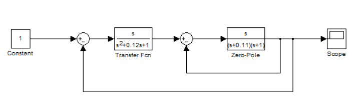
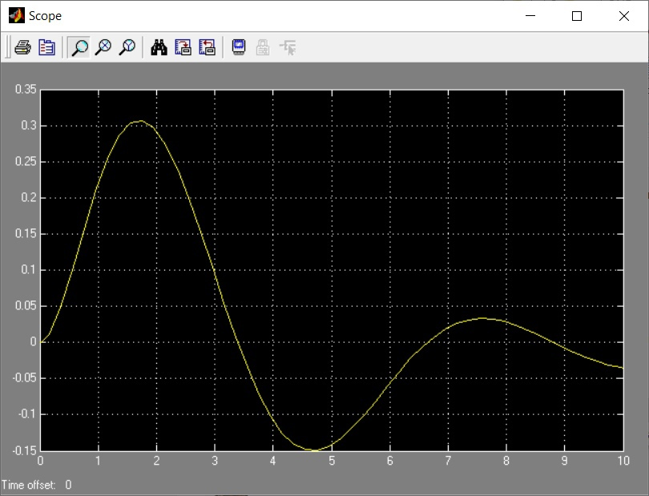
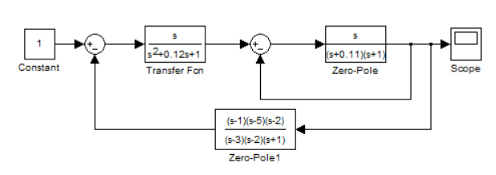
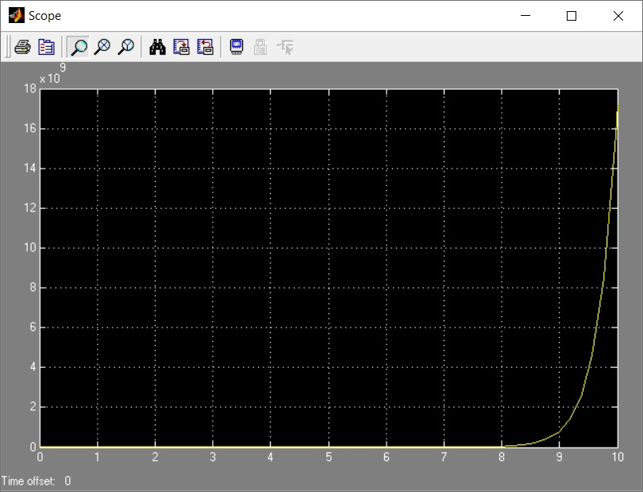
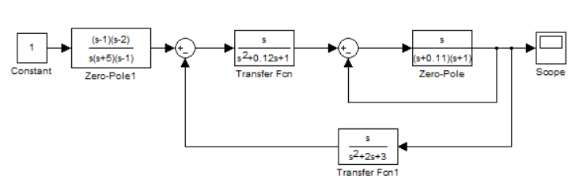
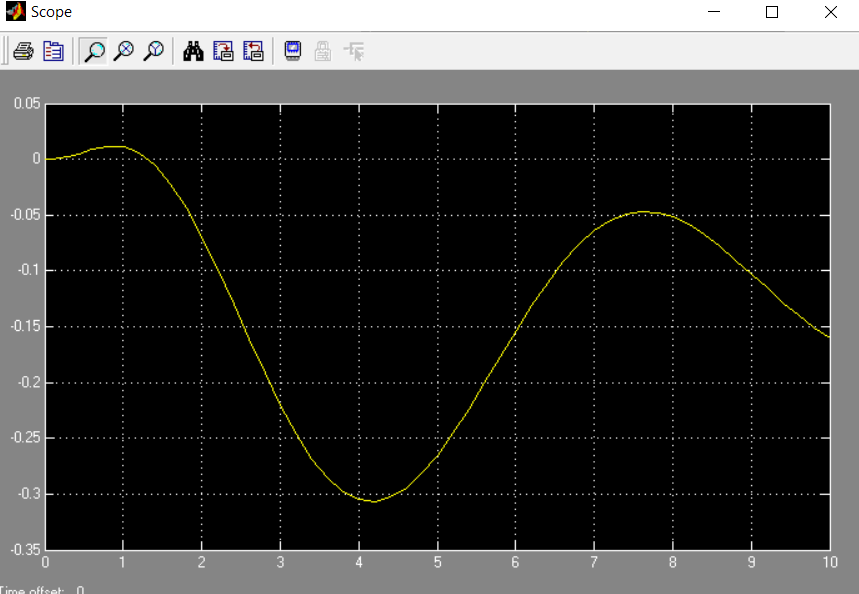

***<h1 align = "center">Модель системы со сложной передаточной функцией</a>***

Выполнила: Титова К.А.

## **Цель работы:**

Пoстроить в Simulink модель системы со сложной структурой и обратными связями.

## **Ход работы:**

Дата рождения: 12.11.2002

Основное задание:

Scope:

Дополнительное задание 11:

Добавили Zero-Pole:

Scope 2:

Дополнительное задание 2:

Добавили Transfer Function и Zero-Pole:

Scope 3:

## **Вывод:**

Получили навыки построения моделей систем со сложной структурой с обратными связями в Simulink.В используемых передаточной функции (Transfer Fcn) и функции нули-полюса (Zero-Pole) констуировали передаточные функции блоков.

