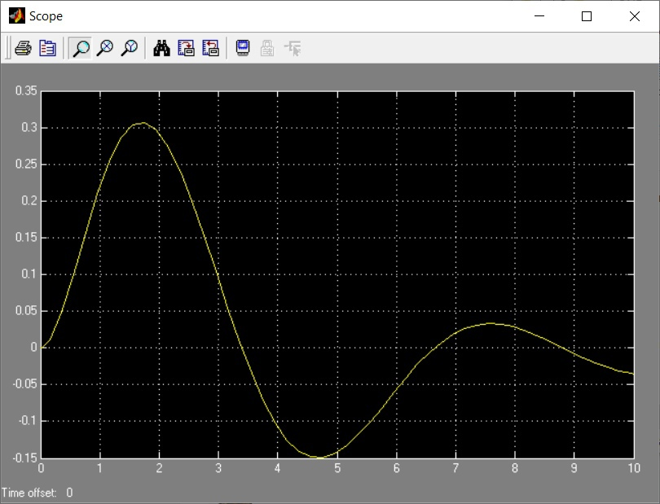
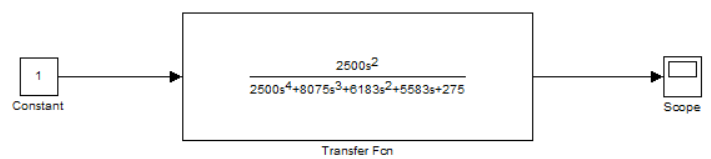
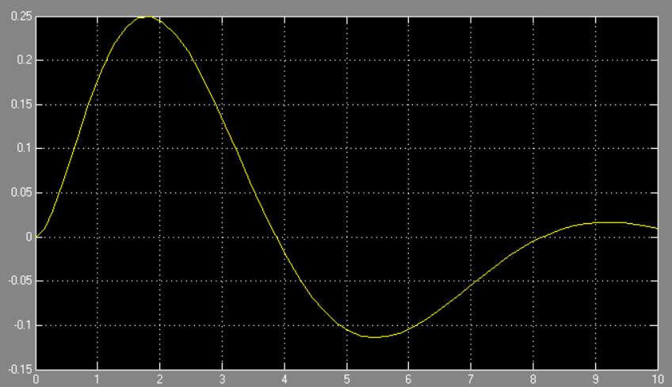
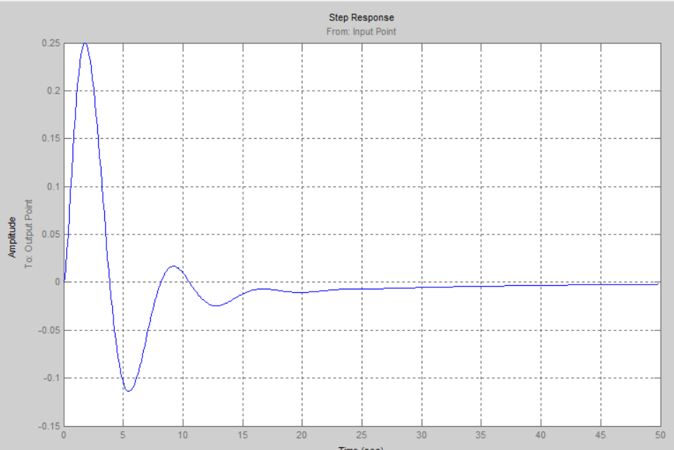
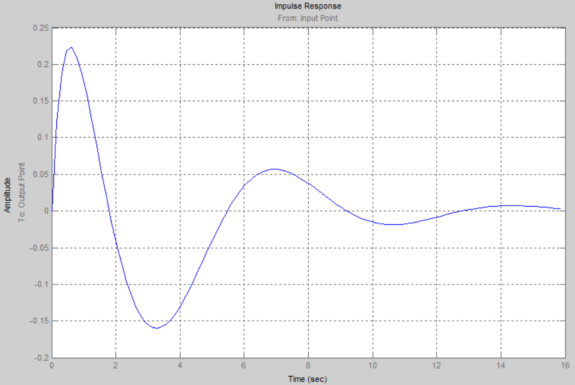
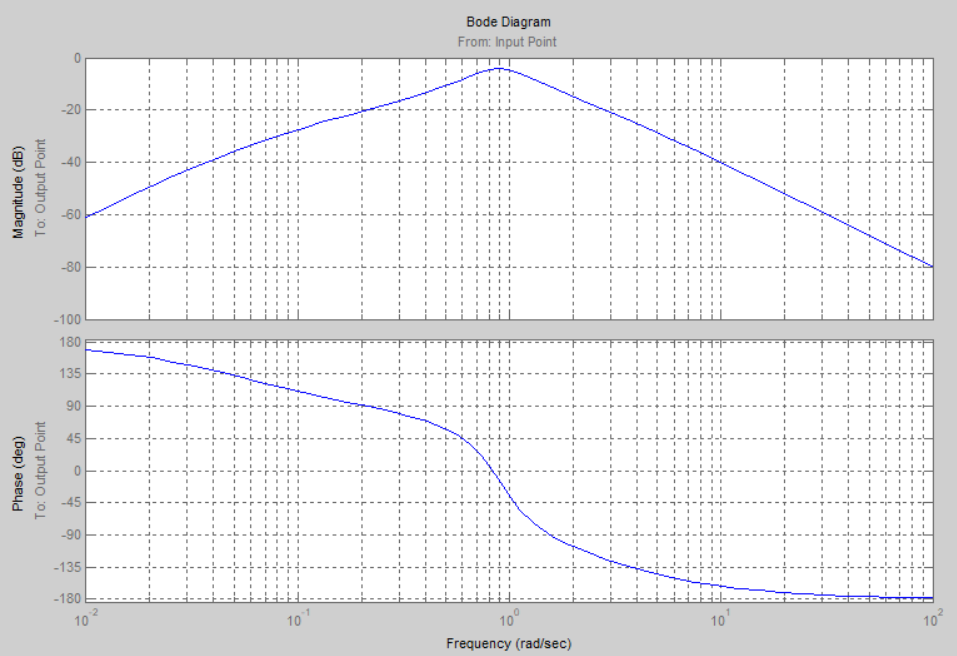
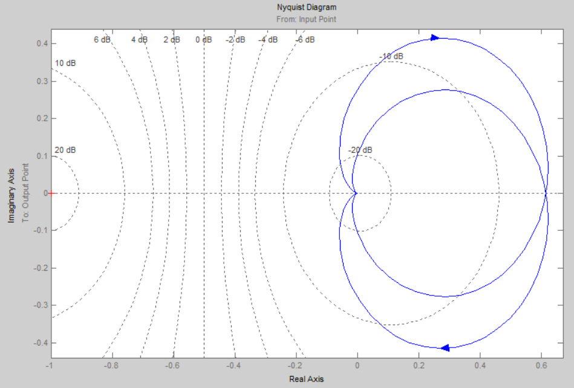
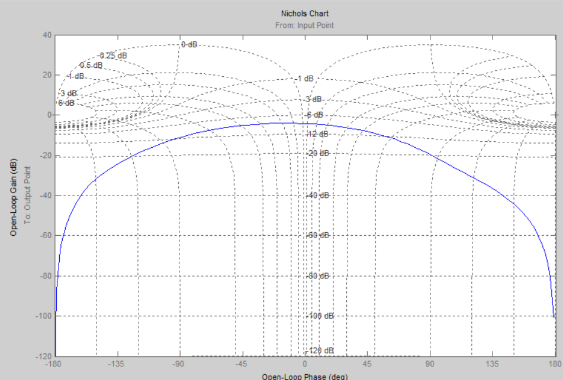
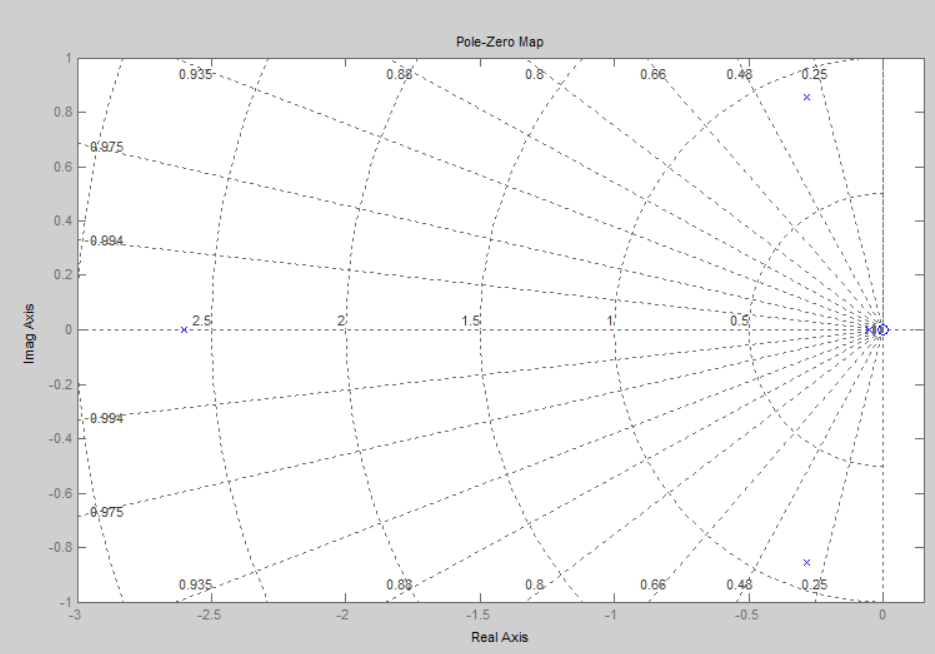

***<h1 align = "center">Модель системы со сложной передаточной функцией созданной и просчитанной вручную</a>***

Выполнила: Титова К.А.

## **Цель работы:**

н
Пoстроить в Simulink модель системы со сложной структурой и обратными связями. В используемых передаточной функции (Transfer Fcn) и функции нули-полюса (Zero-Pole) констуировать передаточные функции блоков. Просчитать передаточную функуцию вручную и определить ее характеристики

## **Ход работы:**

Дата рождения: 12.11.2002

Основное задание:

Scope:

Ручной расчет сложной передаточной функции:
P=-W1

Δ1=1 

W1= - s/(s^2+0.12s+1) * s/((s+0.11)(s+1)= -2500s^2/(2500s^4+3075s^3+3108s^2+2808s+275)

W2= -s/((s+0.11)(s+1))

Δ=1-W1-W2= (2500s^4+8075s^3+6183s^2+5583s+275)/(2500s^4+3075s^3+3108s^2+2808s+275)
тогда наша передаточная функция:

W= (P*Δ1)/Δ=2500s^2/2500s^4+8075s^3+6183s^2+5583s+275

Графики для полученной системы с передаточной функцией:

Графики, полученные с LTI-viewer:

## **Вывод:**

Получили навыки построения моделей систем со сложной структурой с обратными связями в Simulink, просчитали сложную передаточную функцию.

