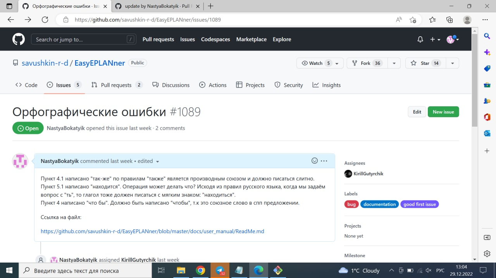

Министерство образования Республики Беларусь
Учреждение образования Брестский Государственный Технический Университет
Кафедра ИИТ
         
## Лабораторная работа №4
## "Работа с проектами"
         
Выполнила:
Студентка 3 курса
Группы АС-59
Бокатюк А.Н.

Проверил:
Иванюк Д.С.
         
Брест 2022

Пункт 4.1 написано "так-же" по правилам "также" является производным союзом и должно писаться слитно.
Пункт 5.1 написано "находится". Операция может делать что? Исходя из правил русского языка, когда мы задаём вопрос с "ть", то глагол тоже должен писаться с мягким знаком: "находиться".
Пункт 4 написано "что бы". Должно быть написано "чтобы", т.к это союзное слово в спп предложении.

