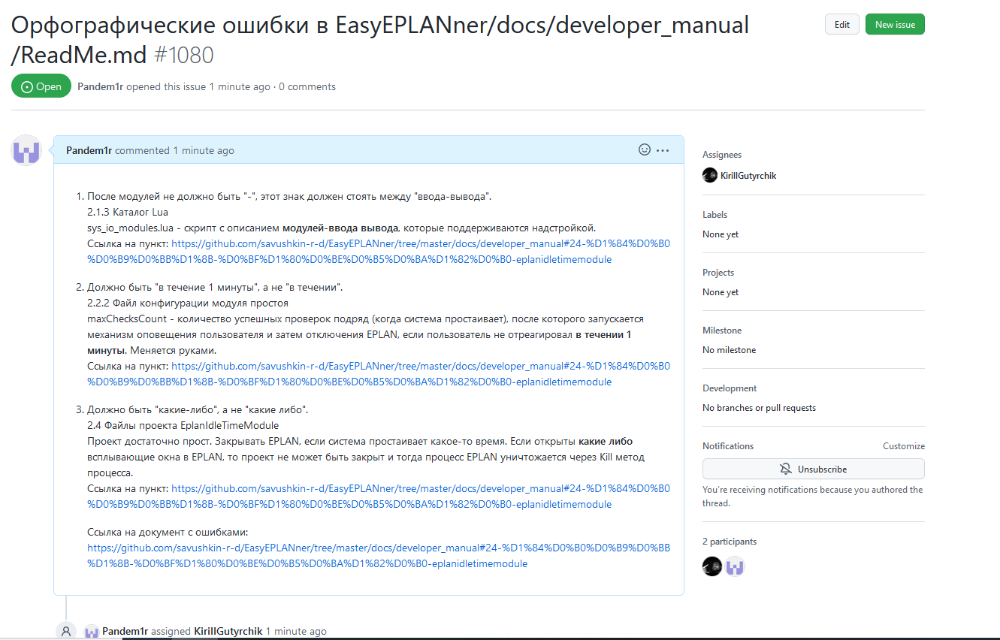

# Лабораторная работа №4 "Работа с проектами"   
Выполнил: Горчинский Н.С.   
Проверил: Иванюк Д.С.  
## Цель работы:  
Изучить предложенные проекты и внести свой вклад в проект (в виде оформления вопросов (issues)):  
 - предложить исправления в ошибках в документации (синтаксические, орфографические и т.п.);
 - предложить исправления в исходном коде;
 - предложить новую функциональность.
## Ход работы  
В ходе изучения предложенных проектов, обнаружил орфографические ошибки и создал issue, в котором указал на них.   

