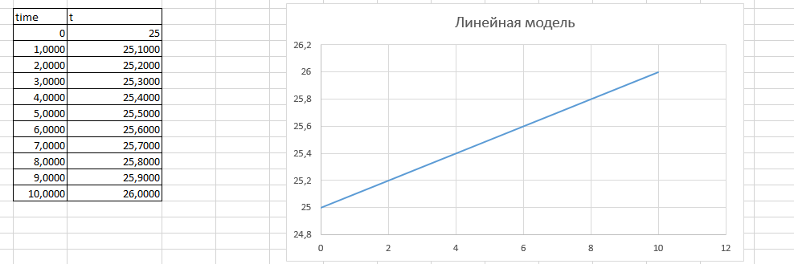
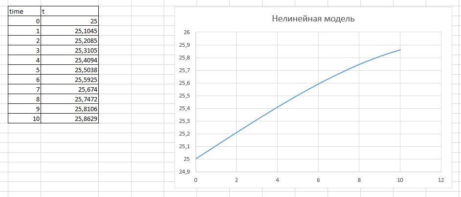

# Лабораторная работа №1
Написал программу, которая имитирует изменение температуры некоторого объекта. Моделирование изменений температуры происходит посредством формул линейной и нелинейной модели из условия задания.  
Изменил константы, тепрь обе модели работают, как по мне, правдоподобно.  
Прикрепляю изображения графиков, основанных на данных, полученных в результате выполнения программы:  
1.Линейная модель  

2.Нелинейная модель  
