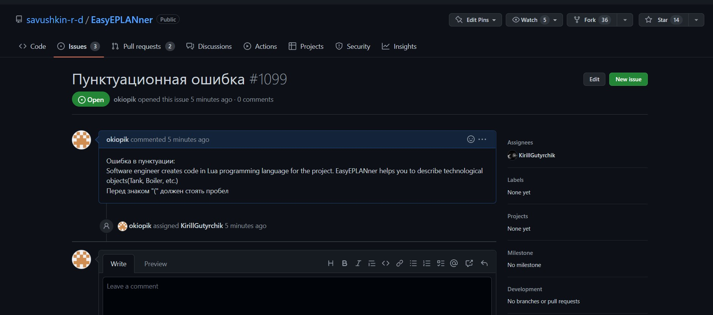
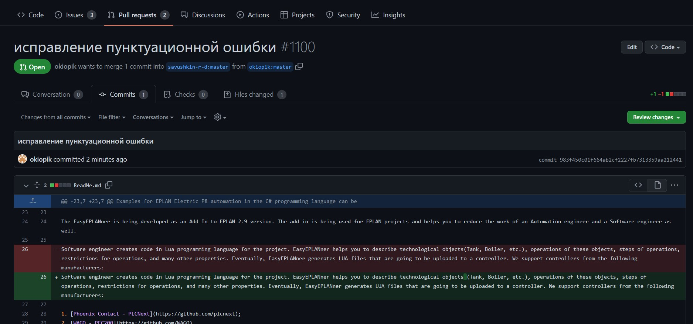
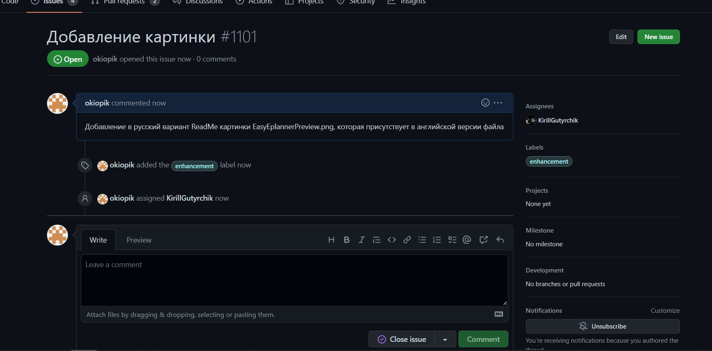

## 
Лабораторная работа №4 «Работа с проектами»

Выполнил: Кивака А.В. 
Проверил: Иванюк Д.С.

***
Создал вопрос о исправлении пунктуационной ошибки.

Создал вопрос с предложением добавить картинку в русскую версию описания репозитория

