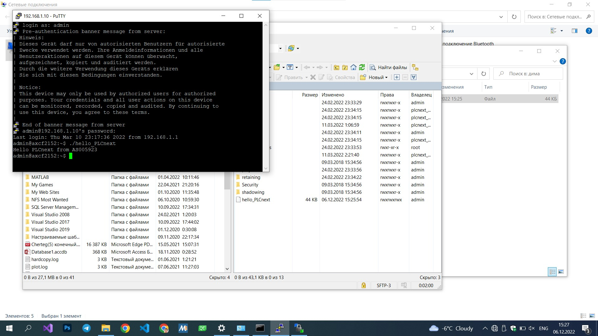

Министерство образования Республики Беларусь
Учреждение образования Брестский Государственный Технический Университет
Кафедра ИИТ
         
## Лабораторная работа №3
## "Работа с контроллером AXC F 2152"
         
Выполнил: 
Студент 3 курса 
Группы АС-59 
Пикун Д.

Проверил: 
Иванюк Д.С.
         
Брест 2022

### Цель работы: запустить проект на контроллере AXC F 215
## Ход работы 

В результате выполнения данной лабораторной работы познакомилис с контроллером AXC F2152.

После сборки в программе VSCODE файла hello_PLCnext закидываем в корнеую папку контроллера с помощью программы winSCP. Дальше подключаемся к контроллеру через Putty и вызываем наш файл через команду ./hello_PLCnext
предварительно изменим права файла на 0777, чтобы избежать ошибки permission denied.
## Результат выполнения программы/

