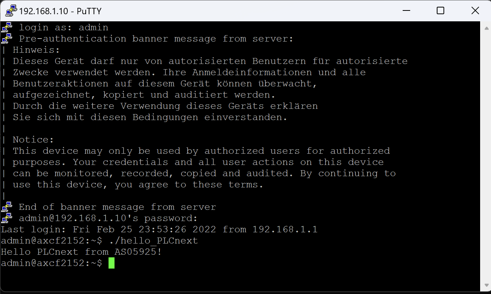

Министерство образования Республики Беларусь
Учреждение образования Брестский Государственный Технический Университет
Кафедра ИИТ
         
## Лабораторная работа №3
## "Работа с контроллером AXC F 215"
         
Выполнил:
Студент 3 курса
Группы АС-59
Сахацкий А.С.

Проверил:
Иванюк Д.С.
         
Брест 2022

### Цель работы: запустить проект на контроллере AXC F 215
## Ход работы 
## Результат выполнения программы

