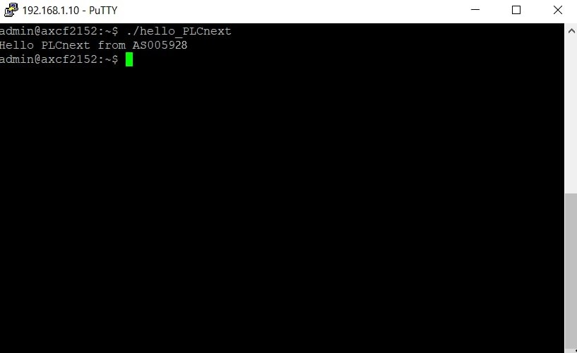

<h1 align = "center">Министерство образования Республики Беларусь  
Учреждение образования Брестский Государственный Технический Университет  
Кафедра ИИТ
</h1>
        
<h2 align = "center">
 Лабораторная работа №3  
 "Работа с контроллером AXC F 2152"
</h2>
        

Выполнила:  
Студент 3 курса  
Группы АС-59  
Хабовец Т.В.  
Проверил:  
Иванюк Д.С.

        

Брест 2022

### Цель работы: запустить проект на контроллере AXC F 2152
Перед началом выполнения работы нам необходимо склонировать указанный репозиторий, установить следующие программы: PuTTy, WinSCP. А также, нам нужно установить необходимые для сборки проекта "main.cpp" расширения для Microsoft Visual Code. Также не забываем дописать в этот проект свои группу и номер.Далее собираем "main.cpp" и приступаем к выполнению данной работы:

1) Подключаем своё устройство к контроллеру.

2) Находим среди видимых сетей Ethernet. Необходимо задать IP-адрес 192.168.1.1 и маску 255.255.255.0.
Далее, с помощью команды ping в консоли проверяем успешность подключения.

3) Далее устанавливаем подключение к контроллеру через программу PuTTY. Логин: admin, пароль: 837b523f.

4) Запустив программу WinSCP, указываем все необходимые выше описанные данные (IP контроллера, имя пользователя, пароль). После чего необходимо перебросить собранный нами проект с нашего устройства в контроллер.

5) Осталось дать нашему файлу все права доступа (0777). После чего необходимо запустить этот файл, используя терминал контроллера.

Результат выполнения программы:

