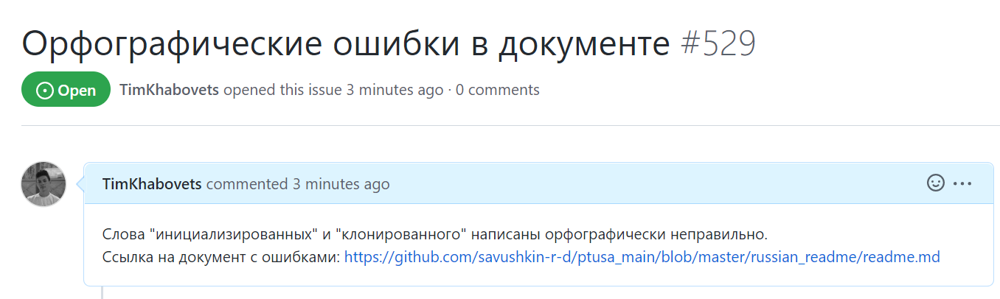

# Лабораторная работа №4 "Работа с проектами"   
Выполнил: Хабовец Т.В.  
Проверил: Иванюк Д.С.  
## Цель работы:  
Изучить предложенные проекты и внести свой вклад в проект (в виде оформления вопросов (issues)):  
 - предложить исправления в ошибках в документации (синтаксические, орфографические и т.п.);
 - предложить исправления в исходном коде;
 - предложить новую функциональность.
## Ход работы  
В ходе изучения предложенных проектов, в документации одного из них были найдены орфографические ошибки. Создал issue, в котором указал на найденные мной недостатки.  
