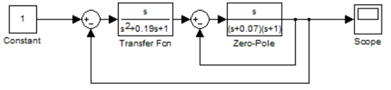

***<h1 align = "center">LTE-viewer</a>***

Выполнил: Марцинкевич И.Г.

Проверил: Пролиско Е.Е.

## **Цель работы:**

Цель: освоить использование LTI-viewer.

## **Задания:**

– подключите LTI-viewer к вашей системе;

 

– получите основные характеристики системы (передаточную функцию, импульсную характеристику, амплитудно-частотную и фазо-частотные характеристики, диаграмму Найквиста, значение нулей и полюсов);

  
Система 1:

 

Система 2:

-зелёным система 1, синим система 2  
Передаточные функции:  

  

Импульсные характеристики:  

  

Амплитудно-частотные и фазо-частотные характеристики:  

  

Диаграммы Найквиста:  

  

Значения нулей-полюсов:  

  

## **Вывод:**

исходя из полученных данных первая система является неустойчивой, так как один из полюсов системы имеет положительную действительную часть. Вторая система является устойчивой, так как все полюса обладают отрицательной действительной частью.

